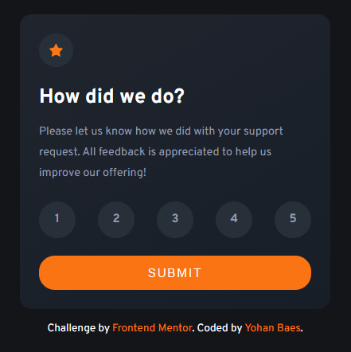
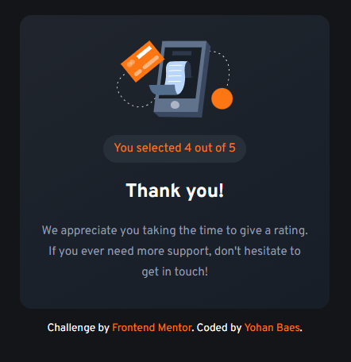

# Frontend Mentor - Interactive rating component

This is a solution to the [Interactive rating component challenge on Frontend Mentor](https://www.frontendmentor.io/challenges/interactive-rating-component-koxpeBUmI).

## The challenge

Your challenge is to build out this page and get it looking as close to the design as possible.

## Screenshot

### First Screenshot

### Second Screenshot

## Links

- Solution URL: https://www.frontendmentor.io/solutions/responsive-interactive-rating-component-i086MtnPVN
- Live Site URL: https://raink31.github.io/021-Interactive-rating-component/

## Built with

- HTML5
- CSS
- Javascript
- Flexbox
- CSS Grid
- Mobile First Workflow

## Author

- Frontend Mentor - https://www.frontendmentor.io/profile/Raink31
